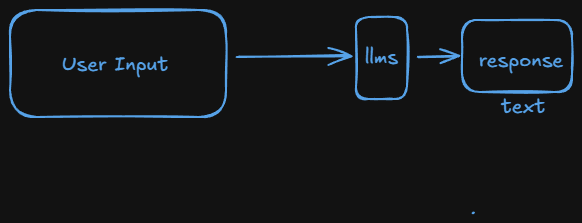
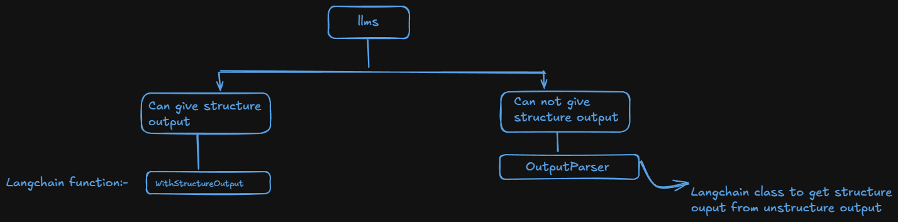
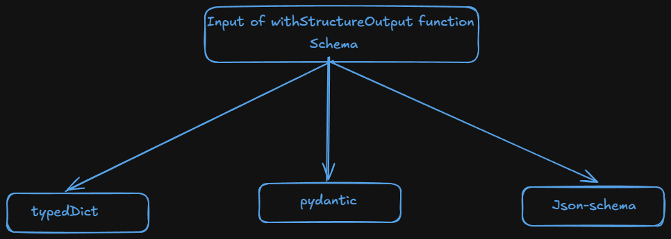
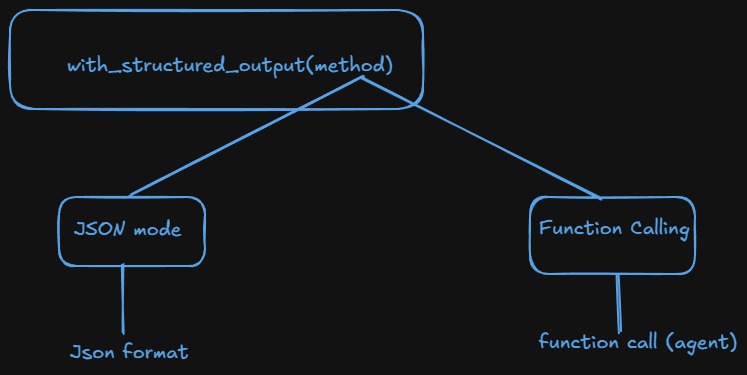

# Structure Output of Langchain

### Unstructured Output:-

- When we communicate with LLMs, we get unstructured output.
- Unstructured output is a list of tuples.



## Structured Output:-

- In Langchain, structure output refers to the practise of having language models return responses in a well defined data format (e.g:- JSON).
- This makes the model output easier to parse and work with programatically.

##### Example:- Prompts - Can you create a one day itinerary for Paris ?

- Here is an suggested itinerary.

  - Morning: Visit Eiffel Tower
  - Afternoon: Walk through the Louvre Museum
  - Evening: Enjoy Dinner at a Seine riverside cafe.

- JSON Enforced Output:
  - [
    {"time" : "Morning", "Activity": "Visit Eiffel Tower"},
    {"time" : "Afternoon", "Activity": "Walk through the Louvre Museum"},
    {"time" : "Evening", "Activity": "Enjoy Dinner at a Seine riverside cafe."}
    ]

> #### Why we need structure format output.

- Data Extraction
  - Example: If we are dealing with a job portal app, at there we need data in structure for extracting data.
  - From a resume we have to extract name, qualification, experience and skills
- API Building
  - If we are dealing with an e-commerce platform at there we need many API to do work.
    - If there is a review section, we need api for fetch review and get the topics, pros, cons and sentiment of the customer.
- Agents
  - If we have a calcultor tasks in any agent when the user will write find the sqrt of 16. calcultor can not understand those text. so we need an agent to communicate between user and calculator.

#### Ways to get structure outputs:-



### 1. withStructureOutput :-



- `with_structured_output()` is a LangChain method that wraps an LLM so that its responses are forced into a predefined structured schema (TypedDict, Pydantic, or JSON), instead of free-text.
- Analody :-

  - LLMs normally return unstructured text:
    - E.g :- Sure! Here is your answer...
  - But real applications need deterministic data: - E.g :-{
    "skills": [],
    "score": 0.82
    }

    > ##### What exactly does it do? (Step-by-Step) ?
    >
    > Internally, it:

        Step 1 : Takes a schema
          - TypedDict
          - Pydantic model
          - JSON schema

        Step 2 : Converts the schema into an OpenAI tool/function

        Step 3 : Forces the LLM to call that tool

        Step 4 : Parses the tool output

        Step 5 : (If Pydantic) validates the output

        Step 6 :Returns structured Python data

  ##### Basic Example :-

  - Without with_structured_output() ❌

    ```python
    llm.invoke("Explain LangChain")
    ```

    Output :- `LangChain is a framework...`

  - With with_structured_output() ✅

    ```python
    from pydantic import BaseModel

    class Explanation(BaseModel):
        topic: str
        summary: str

    structured_llm = llm.with_structured_output(Explanation)

    result = structured_llm.invoke("Explain LangChain")

    ```

    Output :-

    ```
      Explanation(
      topic="LangChain",
      summary="A framework for building LLM applications"
      )
    ```

  ##### Types of Schema in with_structure_output function.

  - There are 3 types of schema or input in with_structure_output function.
    - typedDict
    - pydantic
    - JSON

  #### 1. typedDict :-

  - TypedDict is a clean and Python-native way to get structured output in LangChain, especially if us don’t want full Pydantic models.
  - TypedDict (from typing) lets us define the expected structure of a dictionary with type hints.

    - ✅ Lightweight
    - ✅ No validation overhead
    - ⚠️ Less strict than Pydantic

    ```python
    from typing import TypedDict, List
    from langchain_openai import ChatOpenAI

    class CoursePlan(TypedDict):
        title: str
        duration_weeks: int
        topics: List[str]
        level: str

    llm = ChatOpenAI(model="gpt-4o-mini", temperature=0)

    structured_llm = llm.with_structured_output(CoursePlan)

    res = structured_llm.invoke("Create a GenAI course plan")
    print(res)
    ```

    Output:-

    ```
    {
    'title': 'GenAI Engineer Roadmap',
    'duration_weeks': 12,
    'topics': ['LLMs', 'Prompting', 'RAG', 'Agents'],
    'level': 'Intermediate'
    }
    ```

    - Output is guaranteed dictionary
    - Keys are fixed
    - Works perfectly with FastAPI / Streamlit

  > HR tip:
  > Say this in interview:
  > “I use TypedDict for lightweight deterministic outputs and Pydantic when validation and API safety are required.”

  ##### When Should You Use TypedDict?

  - You want simple structured output
  - You care about speed
  - You don’t need validation
  - Internal tools, PoCs

  ##### ❌ Avoid when:

  - Public APIs
  - User-generated inputs
  - Financial / healthcare apps

  ##### Types of TypedDict :-

  - There are four types of typedDict.

    - simple
    - annotated
    - literal
    -

    ###### (i) simple typedDict :-

    - Using basic Python types directly.

    ```python
    from typing import TypedDict
    from langchain_openai import ChatOpenAI
    from dotenv import load_dotenv

    load_dotenv()
    model = ChatOpenAI(model="gpt-4o-mini", temperature=0)


    class Review(TypedDict):
      summary: str
      sentiment: str

    str_model = model.with_structure_output(Review)
    result = str_model.invoke(""" The hardware is great of the phone but the software lacks sometimes and all remaining are worse.""")

    print(result)
    ```

    - Characteristics
      - No constraints
      - No metadata
      - Most common
      - Fast
    - When to use
      - Internal tools
      - Quick PoCs
      - When precision is not critical

    ###### (ii) Annotated typedDict :-

    - Adds metadata / description to a type.

    ```python
    from typing import TypedDict, Annotated, Optional
    from langchain_openai import ChatOpenAI
    from dotenv import load_dotenv

    load_dotenv()
    model = ChatOpenAI(model="gpt-4.1-nano", temperature=0)

    class Review(TypedDict):
      key_themes: Annotated[str, "Write down all the key themes discussed in the review of the list"]
      summary: Annotated[str, "A brief summary of the review"]
      sentiment: Annotated[str, "The sentiment of the review either positive or negative or neutral"]
      pros: Annotated[Optional[list[str]], "Write down all the pros inside the list"]
      cons: Annotated[Optional[list[str]], "Write down all the cons inside the list"]

    str_model = model.with_structured_output(Review)
    result = str_model.invoke(""" I recently used the Realme 12 Pro+, and unfortunately, my experience was disappointing. While the phone boasts attractive specs on paper, it fell short in several key areas. The software felt unstable, with frequent lags and inconsistent performance during everyday tasks. Battery life was mediocre at best, barely lasting a full day with moderate use. The camera, despite its high megapixel count, struggled in low-light conditions and produced washed-out colors. Additionally, the build quality didn’t feel as premium as expected for a device in this price range. All things considered, I expected much better, but the Realme 12 Pro+ ultimately left me underwhelmed.""")

    print(result)
    ```

    Output:-

    ```
    {'key_themes': 'Software instability, mediocre battery life, underwhelming camera performance in low light, subpar build quality for the price', 'summary': 'The Realme 12 Pro+ failed to meet expectations due to software issues, poor battery endurance, underperforming camera in low-light conditions, and less-than-premium build quality, leading to an overall disappointing experience.', 'sentiment': 'Negative', 'pros': ['Attractive specifications on paper'], 'cons': ['Unstable software with frequent lag', 'Poor battery life barely lasting a day', 'Camera struggles in low-light conditions with washed-out colors', 'Build quality feels less premium than expected']}
    ```

    ###### (iii) Literal typedDict :-

    - Restricts values to exact allowed constants.

    ```python
    from typing import TypedDict, Annotated, Optional, Literal
    from langchain_openai import ChatOpenAI
    from dotenv import load_dotenv

    load_dotenv()
    model = ChatOpenAI(model="gpt-4.1-nano", temperature=0)

    class Review(TypedDict):
      key_themes: Annotated[str, "Write down all the key themes discussed in the review of the list"]
      summary: Annotated[str, "A brief summary of the review"]
      sentiment: Annotated[Literal["pos", "neg"], "The sentiment of the review either positive or negative or neutral"]
      pros: Annotated[Optional[list[str]], "Write down all the pros inside the list"]
      cons: Annotated[Optional[list[str]], "Write down all the cons inside the list"]

    str_model = model.with_structured_output(Review)
    result = str_model.invoke(""" I recently used the Realme 12 Pro+, and unfortunately, my experience was disappointing. While the phone boasts attractive specs on paper, it fell short in several key areas. The software felt unstable, with frequent lags and inconsistent performance during everyday tasks. Battery life was mediocre at best, barely lasting a full day with moderate use. The camera, despite its high megapixel count, struggled in low-light conditions and produced washed-out colors. Additionally, the build quality didn’t feel as premium as expected for a device in this price range. All things considered, I expected much better, but the Realme 12 Pro+ ultimately left me underwhelmed.""")

    print(result["sentiment"])
    ```

    Output: `neg`

    - When to use

      - Status fields
      - Categories
      - Workflow states
      - Agent actions

  #### 2. Pydantic :-

  - Pydantic is a data validation and data parsing library for python.
  - It ensures that the data we work with is correct, structured and type-safe.

  ```python
  from pydantic import BaseModel

  class Student(BaseModel):
    name: str

  new_student = {"name": "Priyansu"}

  student = Student(**new_student)

  print(student)
  ```

  Output:-
  `name='Priyansu'`

  > But

  ```python
  from pydantic import BaseModel

  class Student(BaseModel):
   name: str

  new_student = {"name": 23}

  student = Student(**new_student)

  print(student)
  ```

  Output (Error): `Input should be a valid string [type=string_type, input_value=23, input_type=int]
For further information visit https://errors.pydantic.dev/2.12/v/string_type`

  > Gives error because it validates the data. name should taken a string but when we provide int then it gives us error.

  > In typedDict we can pass a int incase of str, that will not give any error.

  ##### pydantic with Optional :-

  ```python
  from pydantic import BaseModel
  from typing import Optional


  class Student(BaseModel):
    name: str
    age: Optional[int] = None

  new_student = {"name": "Priyansu",  "age": 27}

  student = Student(**new_student)

  print(student)
  ```

  Output:- `name='Priyansu' age=27`

  ##### Pydantic field constraints:-

  ```python
  from pydantic import BaseModel, Field

  class Score(BaseModel):
      value: float = Field(ge=0)  # greater or equal to 0

  res= Score(value=0)
  ress = Score(value=0.5)
  # resss = Score(value=-2)  --> Gives compile time error beacause value should be equal or greater than 0

  print(res, ress)
  ```

  Output:-
  `value=0.0 value=0.5`

  ```python
  from pydantic import BaseModel, Field

  class Scores(BaseModel):
  value: float = Field(ge=0, le=1)  # greater or equal to 0 and lesser or equal to 1

  result = Scores(value = 0.8)
  resultt = Scores(value=1)

  print(result, resultt)
  ```

  Output:-
  `value=0.8 value=1.0`

  ###### Common Constraints in pydantic:-

  | Constraint   | Meaning    |
  | ------------ | ---------- |
  | `ge`         | ≥          |
  | `le`         | ≤          |
  | `gt`         | >          |
  | `lt`         | <          |
  | `min_length` | min length |
  | `max_length` | max length |
  | `regex`      | pattern    |

  ##### Coerce :-

  - Coercion means Pydantic automatically converts input data into the declared type whenever possible.
    ```
    "25"  →  25
    "3.14" → 3.14
    ```
  - Example:-

    ```python
    from pydantic import BaseModel

    class User(BaseModel):
        age: int
        score: float
    u = User(age="25", score="3.5")
    print(u)
    ```

    Output :-
    `   User(age=25, score=3.5)`

  - Coercion with Boolean (Important!) :-

    - It can make "True" to `True` and "False" to `False` or 1 to `True` and 0 to `False`.

  - Similarly coercion works with different type of data types in python.
  - 🎯 Interview One-Liner :- Pydantic performs safe type coercion before validation, which is especially useful when consuming loosely typed data like JSON or LLM outputs.

  ##### BuildIn Validation :-

  - Built-in validation means Pydantic automatically checks and enforces rules without us writing any custom validators.
  - It happens using:

    - Type hints
    - Field constraints
    - Standard Python types

  - Example:-

    ```python
    from pydantic import BaseModel, Field, EmailStr
    from typing import Optional

    class Students(BaseModel):
      name: str
      age: Optional[int] = None
      email: EmailStr

    new_studnt = {"name": "Priyansu",  "age": 27, "email": "abc@gmail.com"}

    # new_student = {"name": 23}

    students = Students(**new_studnt)
    ```

  #### 3. JSON-Schema :-

  - JSON Schema is a standard for describing the structure, types, and rules of JSON data.
  - JSON is universal data format.

  ```python
  from typing import TypedDict, Annotated, Optional, Literal
  from langchain_openai import ChatOpenAI
  from dotenv import load_dotenv

  load_dotenv()
  model = ChatOpenAI(model="gpt-4.1-nano", temperature=0)

  # schema
  json_schema = {
    "title": "Review",
    "type": "object",
    "properties": {
      "key_themes":{
        "type":"array",
        "items": {
          "type": "string"
        },
        "desc": "Write down all the key themes discussed in the review in a list"
      },
      "summary": {
        "type": "string",
        "desc": "A brief summary of the review"
      },
      "sentiment": {
        "type": "string",
        "enum": ["pos", "neg"],
        "desc": "Return sentiment of the review either positive, negative or neutral"
      },
      "pros":{
        "type": ["array", "null"],
        "items":{
          "type": "string"
        },
        "desc": "Write down all the pros inside a list"
      },
      "cons":{
        "type":["array", "null"],
        "items":{
          "type": "string"
        },
        "desc": "Write down all the cons inside a list"
      },
      "name":{
        "type": ["string", "null"],
        "desc": "Write the name of the reviewer"
      }
    },
    "required": ["key_themes", "summary", "sentiment"]
  }


  str_model = model.with_structured_output(json_schema)
  result = str_model.invoke(""" I recently used the Realme 12 Pro+, and unfortunately, my experience was disappointing. While the phone boasts attractive specs on paper, it fell short in several key areas. The software felt unstable, with frequent lags and inconsistent performance during everyday tasks. Battery life was mediocre at best, barely lasting a full day with moderate use. The camera, despite its high megapixel count, struggled in low-light conditions and produced washed-out colors. Additionally, the build quality didn’t feel as premium as expected for a device in this price range. All things considered, I expected much better, but the Realme 12 Pro+ ultimately left me underwhelmed.  Review by Priyansu Dash""")

  print(result)
  ```

  #### When to use what ?

  > ##### TypedDict:-

  - You only need type hints (Basic structure)
  - Don't need validation
  - Trust the llm to return correct data
    > ##### Pydantic:-
  - Need Data Validation
  - Need default values if LLM misses fields.
  - Want automatic type conversion
    > ##### JSON :-
  - Don't want to import extra python libraries(ex:pydantic)
  - Need validation but don't need python objects
  - Want to define structure in a standard JSON format.

  | Situation / Requirement                 | TypedDict  | Pydantic    | JSON Schema       |
  | --------------------------------------- | ---------- | ----------- | ----------------- |
  | **Only type hints (static typing)**     | ✅ BEST    | ❌ Overkill | ❌                |
  | **Runtime validation needed**           | ❌         | ✅ BEST     | ❌                |
  | **Data comes from user / API / LLM**    | ❌         | ✅ BEST     | ❌                |
  | **FastAPI request / response models**   | ❌         | ✅ BEST     | ⚠️ Auto-generated |
  | **LangChain structured output**         | ⚠️ Limited | ✅ BEST     | ⚠️ Internal use   |
  | **LLM tool / function calling**         | ⚠️ Weak    | ✅ BEST     | ✅ REQUIRED       |
  | **Field constraints (min, max, regex)** | ❌         | ✅          | ✅                |
  | **Data coercion (`"25"` → `25`)**       | ❌         | ✅          | ❌                |
  | **Cross-language schema sharing**       | ❌         | ❌          | ✅ BEST           |
  | **OpenAPI / Swagger docs**              | ❌         | ⚠️ Indirect | ✅ BEST           |
  | **Configuration validation**            | ❌         | ✅          | ❌                |
  | **Frontend–backend contract**           | ❌         | ❌          | ✅ BEST           |
  | **Performance (no validation)**         | ✅ FAST    | ❌ Slower   | ❌                |
  | **Production-grade safety**             | ❌         | ✅ BEST     | ⚠️ Depends        |
  | **Learning / quick prototype**          | ✅         | ⚠️          | ❌                |

> ### A few things to remember
>
> 

EX:-

- Openai is support function calling
- Claude, Geminii support JSON mode

> Some llms dont support both

- Ex:- tinyLlama
