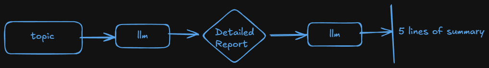
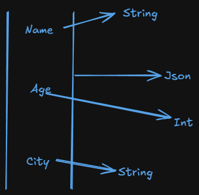

# Output Parsers in Langchain

- Output Parsers in Langchain help convert raw LLM responses into structured formats like JSON, CSV, Pydantic models and more.
- They ensure consistency, validation, and ease of use in applications.

## Types of Output parser

- String output parser
- JSON Output Parser
- Structured Output Parser
- Pydantic Output Parser
- and many more...

### String Output Parser :-

- The StrOutputParser is the simplest output parser in langchain.
- It is used to parse the output of a language model and return it as a plain string.
- Our output generally gives us metadata. There are content, additional_kwargs, etc. When we want the content only we generally write `result.content` to get the content.

  - Use case:-
    

    ```python
    from langchain_huggingface import HuggingFaceEndpoint
    from dotenv import load_dotenv
    from langchain_core.prompts import PromptTemplate

    load_dotenv()

    llm = HuggingFaceEndpoint(
        repo_id="TinyLlama/TinyLlama-1.1B-Chat-v1.0",
        task="text-generation",
        max_new_tokens=512
    )

    # 1st Prompt
    temp1 = PromptTemplate(
        template="Write a detailed report on {topic}",
        input_variables=["topic"]
    )

    prompt1 = temp1.invoke({"topic": "black hole"})
    res1 = llm.invoke(prompt1)

    # 2nd Prompt
    temp2 = PromptTemplate(
        template="Write a 5 line summary of the following text:\n{text}",
        input_variables=["text"]
    )

    prompt2 = temp2.invoke({"text": res1})
    res2 = llm.invoke(prompt2)

    print(res2)

    ```

    > The code is not working because `TinyLlama/TinyLlama-1.1B-Chat-v1.0` is not reliably supported by Hugging Face Hosted Inference providers, especially for chat-style or LangChain usage.

    so,

    ```python
    from langchain_openai import ChatOpenAI
    from dotenv import load_dotenv
    from langchain_core.prompts import PromptTemplate

    load_dotenv()

    model = ChatOpenAI()
    # 1st Prompt
    temp1 = PromptTemplate(
        template="Write a detailed report on {topic}",
        input_variables=["topic"]
    )

    prompt1 = temp1.invoke({"topic": "black hole"})
    res1 = model.invoke(prompt1)

    # 2nd Prompt
    temp2 = PromptTemplate(
        template="Write a 5 line summary of the following text using bullet points:\n{text}",
        input_variables=["text"]
    )

    prompt2 = temp2.invoke({"text": res1})
    res2 = model.invoke(prompt2)

    print(res2.content)
    ```

    Output -

    ```
    - Black holes are regions in space with strong gravitational forces that nothing, not even light, can escape from
    - They are formed when massive stars collapse in on themselves, creating a dense core with intense gravitational pull
    - Black holes have three main components: the event horizon, the singularity, and the accretion disk
    - There are different types of black holes based on their mass and formation, such as stellar, intermediate-mass, and supermassive
    - Astronomers detect and study black holes through their effects on surrounding matter and light, using methods like observing star motion and gravitational lensing.
    ```

- But when we use string output parser,

  ```python
  from langchain_openai import ChatOpenAI
  from dotenv import load_dotenv
  from langchain_core.prompts import PromptTemplate
  from langchain_core.output_parsers import StrOutputParser

  load_dotenv()

  model = ChatOpenAI()
  # 1st Prompt
  temp1 = PromptTemplate(
      template="Write a detailed report on {topic}",
      input_variables=["topic"]
  )

  # 2nd Prompt
  temp2 = PromptTemplate(
      template="Write a 5 line summary of the following text using bullet points:\n{text}",
      input_variables=["text"]
  )

  parser = StrOutputParser()

  chain = temp1 | model | parser | temp2 | model | parser  # temp1 -> model -> parser -> temp2 -> model -> parser (a pipeline)

  result = chain.invoke({'topic': 'blackhole'})

  print(result)
  ```

  > chain = temp1 | model | parser | temp2 | model | parser # temp1 -> model -> parser -> temp2 -> model -> parser (a pipeline) --> This is a LangChain Expression Language (LCEL) pipeline.

  - ##### Step By Step:-
    - temp1 :- "Write a detailed report on blackhole"
    - model :- OpenAI generates a long detailed report
    - StrOutputParser :- StrOutputParser `AIMessage → str`
      - Why needed?
        - Converts model output into plain Python string
        - Required because temp2 expects {text} as a string
    - temp2 :- "Write a 5 line summary of the following text using bullet points"
    - model :- OpenAI generates bullet-point summary
    - StrOutputParser :- Final clean string output

### JSON Output Parser :-

- The output is JSON type.

  ```python
  from langchain_huggingface import ChatHuggingFace, HuggingFaceEndpoint
  from dotenv import load_dotenv
  from langchain_core.prompts import PromptTemplate
  from langchain_core.output_parsers import JsonOutputParser

  load_dotenv()

  llm = HuggingFaceEndpoint(
    repo_id= "google/gemma-2-2b-it",
    task= "text-generation"
  )

  model = ChatHuggingFace(llm = llm)

  parser = JsonOutputParser()

  # Prompt templates

  template = PromptTemplate(
    template= "Give me the age, city, natioanal, job of Sundar Pichai \n {format_instruction}",
    input_variables= [],
    partial_variables= {"format_instruction": parser.get_format_instructions()}
  )

  prompt = template.format()

  res = model.invoke(prompt)

  final_res = parser.parse(res.content)

  print(final_res)
  print(type(final_res))
  ```

  Output:-

  ```
  {'age': 51, 'city': 'Palo Alto, California', 'nationality': 'Indian', 'job': 'Chief Executive Officer, Alphabet Inc. and Google'}
  <class 'dict'>
  ```

- We can do the same thing using chain.

  ```python
  from langchain_huggingface import ChatHuggingFace, HuggingFaceEndpoint
  from dotenv import load_dotenv
  from langchain_core.prompts import PromptTemplate
  from langchain_core.output_parsers import JsonOutputParser

  load_dotenv()

  llm = HuggingFaceEndpoint(
    repo_id= "google/gemma-2-2b-it",
    task= "text-generation"
  )

  model = ChatHuggingFace(llm = llm)

  parser = JsonOutputParser()

  # Prompt templates

  template = PromptTemplate(
    template= "Give me the age, city, natioanal, job of Sundar Pichai \n {format_instruction}",
    input_variables= [],
    partial_variables= {"format_instruction": parser.get_format_instructions()}
  )

  chain = template | model | parser

  result = chain.invoke(input={})  # we have no input_variables. invoke takes an positional arguments so we have to pass an empty dict.
  print(result)  # Get the same output as above

  ```

  #### ✅ When you SHOULD use JsonOutputParser

  - Small structured outputs
  - Strong models (OpenAI / Claude)
  - Controlled environments
  - Short responses

  #### ❌ When you SHOULD NOT use it

  - Weak models
  - Long text
  - Creative tasks
  - Streaming
  - Production without retries

### StructuredOutputParser :-

- StructuredOutputParser is an output parser in Langchain that helps extract structured JSON data from LLM responses based on predefined field schemas.
- It works by defining a list of fields that the model should return, ensuring the output follows a structured format.

  > #### StructuredOutputParser is effectively deprecated in the newest LangChain designs

### PydanticOutputParser:-

- Pydantic Output Parser is a structured output parser in langchain that uses Pydantic models to enforce schema validation when processing LLM responses.

- Why we need to use PydanticOutputParser ?
  - **Strict Schema Enforcement** -> Ensures that LLM responses follow a well-defined structure.
  - **Type Safety** -> Automatically converts LLM outputs into python objects.
  - **Easy Validation** :- Uses Pydantic's bulit in validation to catch incorrect or missing data.
  - **Seamless Integration** :- Works well with other Langchain components.
- Use case:-

  

  ```python
  from langchain_huggingface import ChatHuggingFace, HuggingFaceEndpoint
  from dotenv import load_dotenv
  from langchain_core.prompts import PromptTemplate
  from langchain_core.output_parsers import PydanticOutputParser
  from pydantic import BaseModel, Field

  load_dotenv()

  llm = HuggingFaceEndpoint(
    repo_id= "google/gemma-2-2b-it",
    task = "text-generation"
  )

  model = ChatHuggingFace(llm = llm)

  class Person(BaseModel):
    name: str = Field(description="name of the Person")
    age: int = Field(gt=18, description="Age of the person")
    city: str = Field(description='City Name of the Person belongs from')


  parser = PydanticOutputParser(pydantic_object=Person)

  template = PromptTemplate(
    template = "Generate the name, age and city of fictional {place} person \n {format_instruction}",
    input_variables= ['place'],
    partial_variables={'format_instruction': parser.get_format_instructions()}
  )

  chain = template | model | parser
  final_res = chain.invoke({'place': 'Nepali'})

  print(final_res)
  ```
