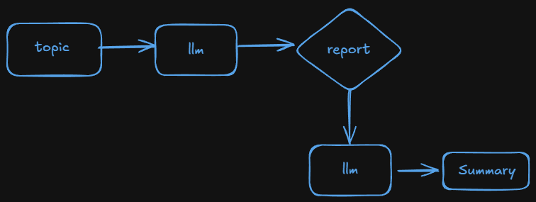
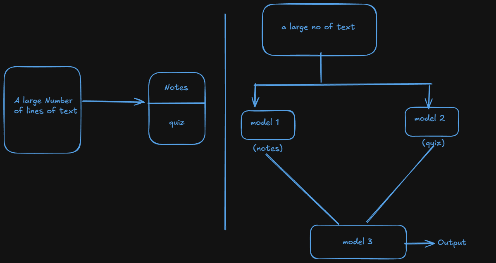
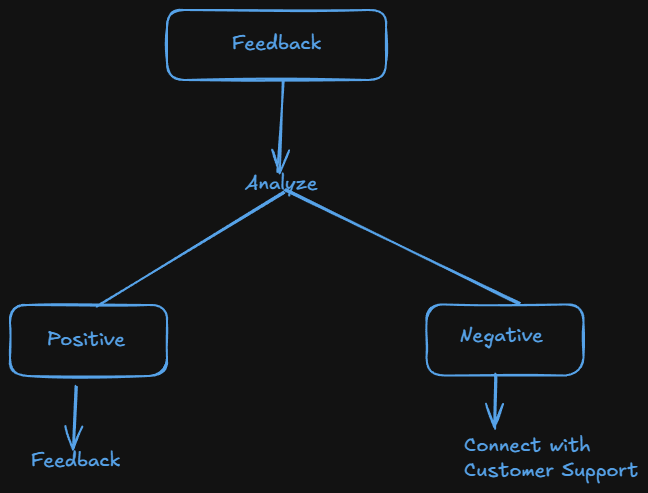

# Chains in Langchain

- ### What ?
  - A chain lets us run multiple LLM-related operations in sequence as one workflow.
  - Auomatically 1st step output is 2nd step input and 2nd output is 3rd step input and so on...
- ### Why ?

  - Without chains:

    - We manually call the model again and again

    - We handle outputs and inputs yourself

    - Code becomes repetitive and error-prone

  - With chains:

    - Steps are connected automatically

    - Code is cleaner and reusable

    - Complex workflows become easy to manage

    `Step 1 → Step 2 → Step 3 → Final Output`

## Types of Chain

- Simple Chain
- Sequential Chain
- Parallel Chain
- Conditional Chain

### Simple Chain:-

- A Simple Chain in LangChain is the most basic pipeline where: `One prompt → One model → One output`
- There is no multiple steps, no branching—just a single flow.

```python
from langchain_openai import ChatOpenAI
from dotenv import load_dotenv
from langchain_core.prompts import PromptTemplate
from langchain_core.output_parsers import StrOutputParser

load_dotenv()

prompt = PromptTemplate(
  template = 'Generate 5 instructing fact about {topic}',
  input_variables=['topic']
)

model = ChatOpenAI()

parser = StrOutputParser()

chain = prompt | model | parser

res = chain.invoke({'topic': "GenAI"})

print(res)
```

### Sequential chain:-

- A Sequential Chain is a multi-step pipeline where:
  ```
      Output of Step-1 becomes input of Step-2,
      Output of Step-2 becomes input of Step-3, and so on.
  ```
- Use case:-
  

  ```python
  from langchain_openai import ChatOpenAI
  from dotenv import load_dotenv
  from langchain_core.prompts import PromptTemplate
  from langchain_core.output_parsers import StrOutputParser

  load_dotenv()

  prompt1 = PromptTemplate(
    template= 'Generate a detailed report on {topic}',
    input_variables= ['topic']
  )

  prompt2 = PromptTemplate(
    template = 'Generate a 5 pointer summary from the following text \n {text}',
    input_variables=['text']
  )

  model = ChatOpenAI()

  parser = StrOutputParser()

  chain = prompt1 | model | parser | prompt2 | model | parser

  res = chain.invoke({'topic': "GenAI affect on software engineering"})

  print(res)
  ```

### Parallel Chain :-

- A Parallel Chain runs multiple prompts at the same time on the same input and returns all outputs together.
  ```
            ┌── Prompt A → LLM → Output A
  Input ────┼── Prompt B → LLM → Output B
            └── Prompt C → LLM → Output C
  ```
- Use case :-
  

  ```python
  from langchain_openai import ChatOpenAI
  from langchain_huggingface import HuggingFaceEndpoint, ChatHuggingFace
  from dotenv import load_dotenv
  from langchain_core.prompts import PromptTemplate
  from langchain_core.output_parsers import StrOutputParser
  from langchain_core.runnables import RunnableParallel

  load_dotenv()


  model1 = ChatOpenAI()

  llm = HuggingFaceEndpoint(
      repo_id="google/gemma-2-2b-it",
      task="text-generation",   # HF internally handles chat
      max_new_tokens=300,
      temperature=0.7
  )


  model2 = ChatHuggingFace(llm=llm)
  prompt1 = PromptTemplate(
    template="Generate short and simple notes from the following text \n {text}",
    input_variables=["text"]
  )

  prompt2 = PromptTemplate(
    template="Generate 5 short question answers from the following text \n {text}",
    input_variables=["text"]
  )

  prompt3 = PromptTemplate(
    template="Merge the provided notes and quiz into a single document \n notes -> {notes} and quiz -> {quizs}",
    input_variables= ["notes", "quizs"]
  )

  parser = StrOutputParser()

  # Parallel chain

  parallel_chain = RunnableParallel({
    "notes": prompt1 | model1 | parser,
    "quizs": prompt2 | model2 | parser
  })

  # merge both
  merge_chain = prompt3 | model1 | parser

  chain = parallel_chain | merge_chain

  text = """
    Artificial Intelligence (AI) is a field of computer science that focuses on building systems capable of performing tasks that normally require human intelligence. These tasks include learning from data, understanding natural language, recognizing patterns, and making decisions. AI systems are commonly classified into narrow AI, which is designed to perform a specific task, and general AI, which aims to perform any intellectual task a human can do. Modern AI heavily relies on machine learning techniques, especially deep learning, which uses neural networks with multiple layers to process large amounts of data. AI is widely used in real-world applications such as healthcare, finance, education, transportation, and virtual assistants, helping improve efficiency, accuracy, and automation.
  """

  result = chain.invoke({"text": text})

  print(result)
  ```

### Conditional Chain :-

- A Conditional Chain executes different chains based on a condition.
- `Think of it like if–else logic for LLM pipelines.`
  ```
           ┌─> Chain A (if condition A)
  Input ────┤
           └─> Chain B (if condition B)
  ```
- Use case:-
  

  - We can developer for now if positive feedback then response is different and for negative the response is different.

  ```python
  from langchain_openai import ChatOpenAI
  from dotenv import load_dotenv
  from langchain_core.prompts import PromptTemplate
  from langchain_core.output_parsers import StrOutputParser
  from langchain_core.runnables import RunnableBranch, RunnableLambda
  from langchain_core.output_parsers import PydanticOutputParser
  from pydantic import BaseModel, Field
  from typing import Literal

  load_dotenv()

  model = ChatOpenAI()

  parser = StrOutputParser()

  class Feedback(BaseModel):
    sentiment: Literal["positive", "negative", "neutral"] = Field(description="Give the sentiment of the feedback")

  parser2 = PydanticOutputParser(pydantic_object=Feedback)

  prompt1 = PromptTemplate(
    template= "Classify the sentiment of the following text into positive, negative or neutral. \n {feedback} \n {format_instruction}",
    input_variables=["feedback"],
    partial_variables= {'format_instruction': parser2.get_format_instructions()}
  )

  classifier_chain = prompt1 | model | parser2

  # res = classifier_chain.invoke({"feedback": "This is not good"})
  # print(res)

  # 2nd part --> Branching

  prompt2 = PromptTemplate(
    template = "Write an approprite response to this positive feedback \n {feedback}",
    input_variables=['feedback']
  )
  prompt3 = PromptTemplate(
    template = "Write an approprite response to this Negative feedback \n {feedback}",
    input_variables=['feedback']
  )
  prompt4 = PromptTemplate(
    template = "Write an approprite response to this Neutral feedback \n {feedback}",
    input_variables=['feedback']
  )

  branch_chain = RunnableBranch(
    (lambda x:x.sentiment == 'positive', prompt2 | model | parser),
    (lambda x:x.sentiment == 'negative', prompt3 | model | parser),
    (lambda x:x.sentiment == 'neutral', prompt4 | model | parser),
    RunnableLambda(lambda x: "Could not find any sentiment...")
  )

  chain = classifier_chain | branch_chain

  result = chain.invoke({"feedback": """he Samsung Galaxy S24 Ultra is an impressive flagship device with a stunning display and powerful performance. Its Dynamic AMOLED screen offers vibrant colors and sharp detail, making videos and gaming visually immersive. The camera system, especially the 200MP main sensor and advanced zoom capabilities, captures high-quality photos even in low light. Battery life comfortably lasts a full day with moderate to heavy use, and the build quality feels premium with a solid and ergonomic design.On the downside, the S24 Ultra comes with a high price tag that may deter budget-conscious buyers, and some users may find the phone a bit large and heavy for one-handed use. While the software experience is generally smooth, occasional bloatware and persistent pre-installed apps can feel unnecessary. Additionally, fast charging speeds are good but not class-leading compared to some competitors. Overall, the S24 Ultra delivers cutting-edge features, but the cost and size may not be ideal for everyone. """})

  print(result)
  ```
