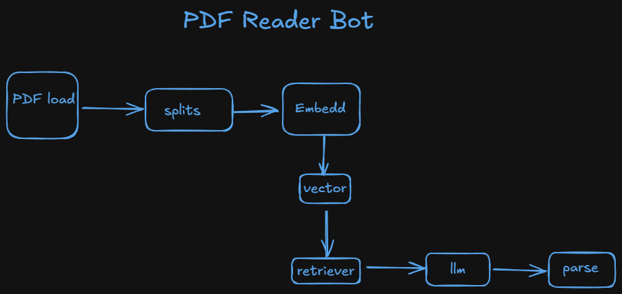
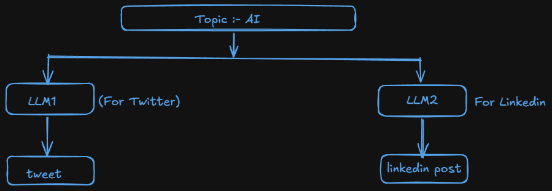

# Runnables in Langchain

- **What** ?
  - Runnables are the core building blocks of LangChain pipelines.
    > Anything that can take input → process → return output is a Runnable.
- **Why** ? :-

  - Use case:
    

  - Visit for some deep knowldge how langchain created its compos using dummy compos:-
    - [https://colab.research.google.com/drive/1F6Rln2CpS-4Zlxuavf-1WKSa2VrqknR7#scrollTo=hsXcGL22B7u9] -> WITH RUNNABLES
    - [https://colab.research.google.com/drive/1VvF1qxT84CvGnVHBGTx6f01fUvYaPrFg#scrollTo=ZOExcINk7NcE] -> WITHOUT RUNNABLES

## Types of Runnables :-

- Task specific runnables
- Runnable Primitives

### Task Specific Runnables :-

- These are core Langchain components that have been converted into runnables so they can be used in a pipelines.
- **Purpose**:- Perform task-specific operations like LLM calls, prompting, retrieval and etc.
- **Examples**:-
  - `ChatOpenAI` - Runs an LLM model.
  - `PromptTemplate` - Format prompts dynamically.
  - `Retriever` - Retreive related documents.

### Runnable Primitives :-

- These are fundamantal building blocks for structuring execution logic in AI workflows.
- **Purpose**:- They help orchestrate execution by defining how different Runnables interact(sequentially, in parallel, conditionally).
- **Examples**:-
  - `RunnableSequence` :- Runs step in order (| operator)
  - `RunnableParallel` :- Runs mmultiple steps simultaneously.
  - `RunnableMap` :- Maps the same input across multiple functions.
  - `RunnableBranch` :- Implements conditional execution (if-else logic).
  - `RunnableLambda` :- Wraps custom python functions into Runnables.
  - `RunnablePassthrough` :- Just forwards input as output (act as placeholder).

#### RunnableSequence :-

- RunnableSequence is a sequential chain of runnables in Langchain that executes each step one after another, passing the output of one step as the input to the next.
- It is useful when you need to compose multiple runnables together in a structured workflow.

  ```python
  from langchain_openai import ChatOpenAI
  from langchain_core.prompts import PromptTemplate
  from langchain_core.output_parsers import StrOutputParser
  from dotenv import load_dotenv
  from langchain_core.runnables import RunnableSequence

  load_dotenv()

  prompt = PromptTemplate(
    template= "Write a joke about this {topic}",
    input_variables= ['topic']
  )

  model = ChatOpenAI()

  parser = StrOutputParser()

  chain = RunnableSequence(prompt, model, parser)

  chain2 = prompt | model | parser

  res = chain.invoke({'topic': "AI"})

  result = chain2.invoke({'topic': "AI"})

  print(res)

  print(result)
  ```

  - _***Que***_ :- Both chains using RunnableSequence or Pipe operator works same ?
    > Yes, both chains are the same. The pipe operator | automatically creates a RunnableSequence, so explicitly using RunnableSequence is unnecessary and discouraged in modern LangChain.

#### RunnableParallel :-

- RunnableParallel is a runnable primitive that allows multiple runnables to execute in parallel.
- Each runnable receives the same input and processes it independently, producing a dictionary of outputs.
- Use Case:-
  

  ```python
  from langchain_openai import ChatOpenAI
  from langchain_core.prompts import PromptTemplate
  from langchain_core.output_parsers import StrOutputParser
  from dotenv import load_dotenv
  from langchain_core.runnables import RunnableSequence, RunnableParallel

  load_dotenv()

  prompt_for_x = PromptTemplate(
    template= "Generate a tweet about {topic}",
    input_variables= ['topic']
  )


  prompt_for_linkedin = PromptTemplate(
    template= "Generate a post about {topic}",
    input_variables= ['topic']
  )

  model = ChatOpenAI()

  parser = StrOutputParser()

  parallel_chain = RunnableParallel({
    "tweet": RunnableSequence(prompt_for_x, model, parser),
    "linkedin": RunnableSequence(prompt_for_linkedin, model, parser)
  })

  # parallel_chain2 = RunnableParallel({
  #  "tweet": prompt_for_x | model | parser,
  # "linkedin": prompt_for_linkedin | model | parser
  # })

  res = parallel_chain.invoke({'topic': "AI"})

  print(res)
  ```
