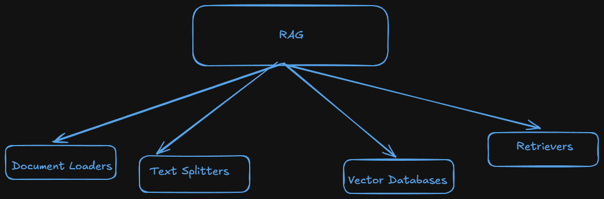

# Document Loaders in Langchain

- Document loaders are component in Langchain used to load data from various sources into a standardized format(usually as document objects), which can then be used for chunking.
- Document loaders is one of the component of RAG.
  
- In langchain there are more than 100 document loaders.
- Main document(the most use) loaders are:-

  - TextLoader
  - PyPDFLoader
  - WebBaseLoader
  - CSVLoader

- Syntax :-
  ```python
  Document(
    page_content = "The actual text content",
    metadata = {"source": "filename.pdf", ...}
  )
  ```

## TextLoader :-

- TextLoader is a simple and commonly used document loader in langchain that reads plain text(`.txt`) files and converts them into Langchain Document objects.
- **Use Cases**:-

  - Ideal for loading chat logs, scraped text, transcripts, code snippets or any plain text data into a langchain pipeline.

- **Limitation** :-

  - Works for only `.txt` files

  ```python
  from langchain_community.document_loaders import TextLoader

  loader = TextLoader('./files/cricket.txt', encoding='utf-8')


  text_docs = loader.load()

  print(text_docs) # Output as in a list.

  print(type(text_docs))  # list

  print(text_docs[0]) # get the document text

  print(type(text_docs[0])) # langchain_core.documents.base.Document
  ```
