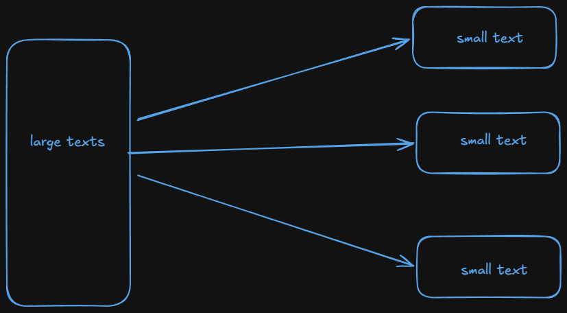
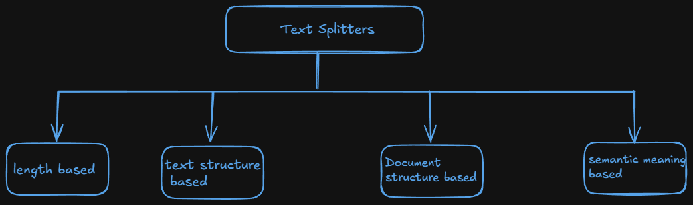
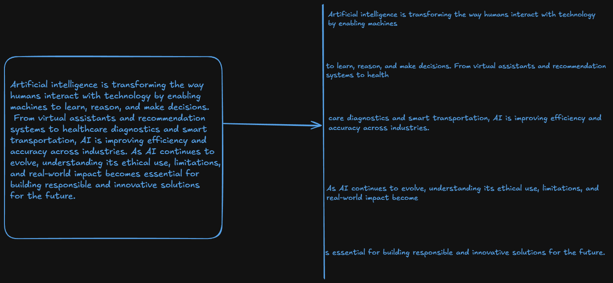

# Text Splitting

- Text splitting is the process of breaking large chunks of text(like articles, PDFs, HTML Pages or books) into smaller, managebale pieces(chunks) that an LLM can handle effectively.

  

- **Overcoming model limitations**:-
  - Many Embedding models and language models have maximum input size constraints.
  - Splitting allows us to process documents that would otherwise exceed these limits.
- **Downstream tasks**:-
  - Text splitting improves nearly every LLM powered task.

| Task            | Why Splitting Helps                             |
| --------------- | ----------------------------------------------- |
| Embedding       | Short chunks yield more accurate vectors        |
| Semantic search | Search results point to focused info, not noise |
| Summarization   | Prevents halluciation and topic drift           |

- Optimizing computational resources :-
  - Working with smaller chunks of text can be more memroy efficient and allow for better parallelization of processing task
    

## 1. length-based text splitting :-

- This is simple way of splitting and very fast
  
- When we divide a paragraph into 5 different parts with 100 characters to everyone (may be last one has less characters) then we can found that some word can split. means from "read" one sentence has "re" and the next sentence starts from "ad", that will be a problematic part. so, it is not use many times

  ```python
  from langchain_text_splitters import CharacterTextSplitter
  from langchain_community.document_loaders import PyPDFLoader

  loader = PyPDFLoader('./files/genai_roadmap_google.pdf')

  docs_pypdf = loader.load()


  splitter = CharacterTextSplitter(
    chunk_size = 100,
    chunk_overlap = 0,  # chunk_overlap said overlap between two chunks
    separator = ''
  )

  res = splitter.split_documents(docs_pypdf)

  print(res[0])
  ```
