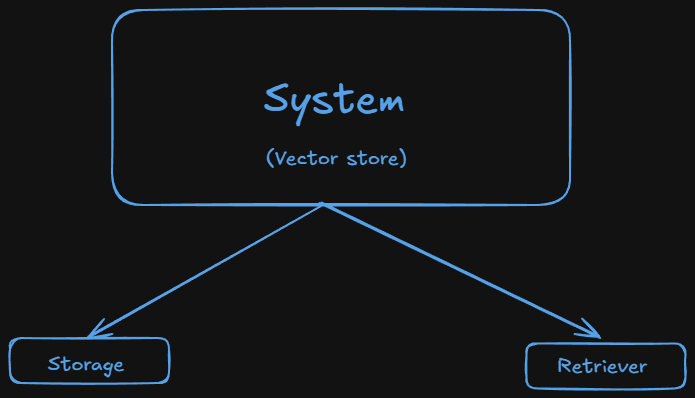

# Vector stores in Langchain

- **Why** ? :-

  - A vector store enables semantic search over documents by storing embeddings, allowing LangChain to retrieve relevant context for accurate, grounded LLM responses.
  - Vector stores give LLMs long-term semantic memory.

- What ? :-

  - A vector store is a system designed to store and retrieve data represented as numerical vectors.

  - Key features :-
    - **Storage** :- Ensures that vectors and their associated metadata are retained, wheather in-memory for quick lookups or on-disk for durability and large-scale use.
    - **Similarity Search** :- Helps retrieve the vectors most similar to a query vector.
    - **Indexing** :- Provide a data structure or method that enables fast similarity searches on high-dimensional vectors (e.g:- approximaate nearest neighbour lookups).
    - **CRUD Operation** :- Manage the lifecycle of data-adding new vectors, reading them, updating existing entries, removing outdated vectors.
  - Use cases :-
    - Semantic search
    - RAG
    - Recommender systems
    - Image/Multimedia search

## Vector store vs Vector Database

### Vector store :-

- Typically refers to a lightweight library or service that focuses on storing vectors and performing similarity searches.
- May not include many traditional database features like indexing, transactions, rich query languages or role-based access control.
- Ideal for prototyping and small scale applications.
- Examples :- `FAISS` - A facebook library where we store vectors and perform similarity searches. but we handle persistence and scaling separately.

### Vector database :-

- A full-fledged database system designed to store and query vectors.
- Offers additional database-like features.
  - Distributed architecture for horizontal scaling.
  - Durability and persistence. (replication, backup, etc.)
  - Metadata handling(Schemas, filters, etc.)
  - Potential for ACID or near ACID guarentees.
  - Authentication/authorization and more advanced security features.
- Geared for production enviroments with significant scaling, large datasets
- Examples :- Milvus, Qdrant, Pinecone, Weaviate, etc

> A vector database effectively a vector store with extra database features
> Example:- Clustering, scaling, security, metadata filtering, etc

## Vector store in Langchain :-

- **Supported Stores** :- Langchain integrates with multiple vector stores (FAISS, Pinecone, Chroma, Qdrant, Weaviate and etc), giving us flexibility in scale, features and deployment.
- **Common Interface** :- A uniform vector store api lets us swap at one backend(E.g FAISS) for anotehr (E.x: Pinecone) with minimal code changes.
- **Metadata Handling** :- Most vector stores in Langchain allows us to attach metadata (E.x: timestamps, authors) to each document, enabling filter-based retrieval.

### Chroma Vector Stores :-

- Chroma is a lightweight, open-source vector database that is especially friendly for local development and small to medium scale production needs.
