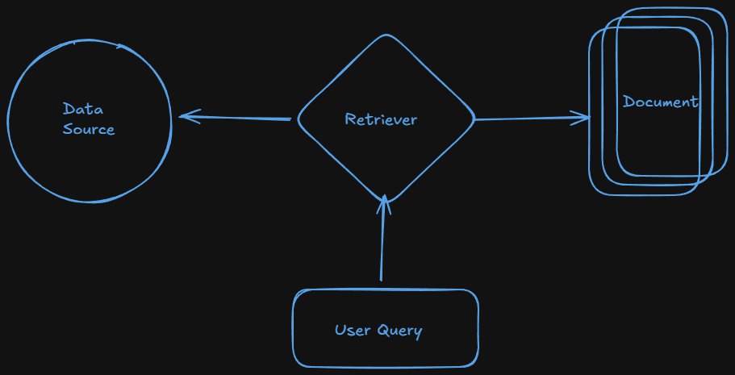

# Retreivers in Langchain

## What is Retrievers ?

- One of the core component of RAG which fetches relevant documents from a data source in response to a user's query.
- There are multiple types of retrievers
  
- Data source can be a vector store or an API.
- Retriever needs user query as input and gives multiple document objects as output.

## Types of Retrievers :-

- We can divide retriever types into two categories

- There are a lot of retriever in langchain.
  - Wikipedia retriever
  - Vector Store Retriever (Most Common)
  - Similarity Retriever
  - Multi-Query Retriever
  - Contextual Compression Retriever

### Wikipedia retriever :-

- A wikipedia retriever is a retriever that queries the wikipedia API to fetch relevant content for a given query.
- ##### **How it works** ?
  - User give a query (e.g Virat Kohli).
  - The retriever sends a query to wikipedia API.
  - It retrievs the most relevant articles.
  - It returns them as Langchain `Document` objects.
    > Visit https://colab.research.google.com/drive/1ApZMyI7uAn1W-IwDVwh_ott--ojDJV-1#scrollTo=NUFVcL8_mOzp for code

### Vector Store Retriever :-

- A vector store retriever in Langchain is the most common type of retriever that lets us search and fetch documents from a vector store based on semantic similarity using vector embeddings.
- ##### **How it works** ? :-
  - We store our documents in a vector store (like FAISS, Chroma, Pinecone, etc).
  - Each document is converted into a dense vector using an embedding model.
  - When the user enters a query:
    - It is also turned into a vector.
    - The retriever compares the query vector with the stored vectors.
    - It retrieves the top-k most similar ones.
