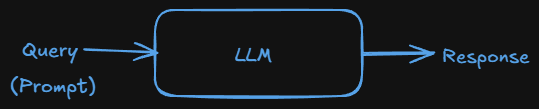

# RAG in Langchain

## What is RAG ?

- As we know LLMs are giant transformer based nuerological archiotecture and LLMs are trained with billions of data.
- So, LLMs have nearly all knowldege about the world and LLMs are stored the data in parameters as numbers. so this knowledge known as parametric knowledge.
- Let we have a LLM which has many data in its parameter, then how can we access the data from it.. ---> Using Prompting.

  

- There are certain situation where the flow does not work, where we can not generate good response from LLM using Prompting.
- Situations Example:-
  1. Where I ask LLM about my private data(from my private website). Any LLM has not trained about our private data, so it can not answer
  2. When we ask about recent or today's news to LLM because LLM has knowledge cutoff(When LLM was trained last). so, LLM can not respond us.
  3. Halucination:- Sometimes LLM can give incorrect response with confidently.
  - **So, what is the correct way to handle LLM. This is known as fine-tuning.**

### Fine tuning :

- We take a pretrained LLM and train it using some outsource data.

  > #### Analogy:- A student got a it job in his college last year. Student is LLM here and the college syallbus is pretraining and when he got a job and got training in company that training is fine-tuning

- Types of fine-tuning.
  - Supervised fine tuning
  - Continued pre training (unsupervised fine tuning)
