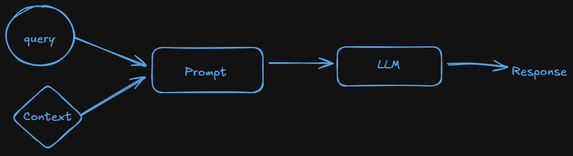
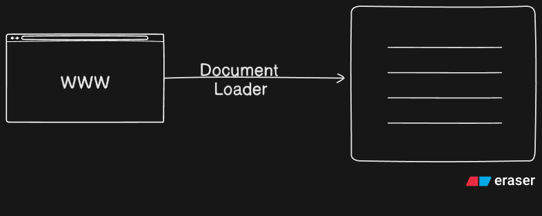
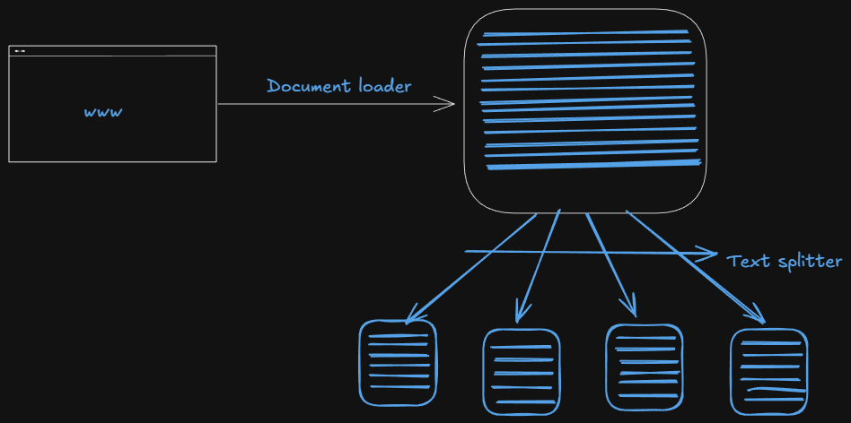
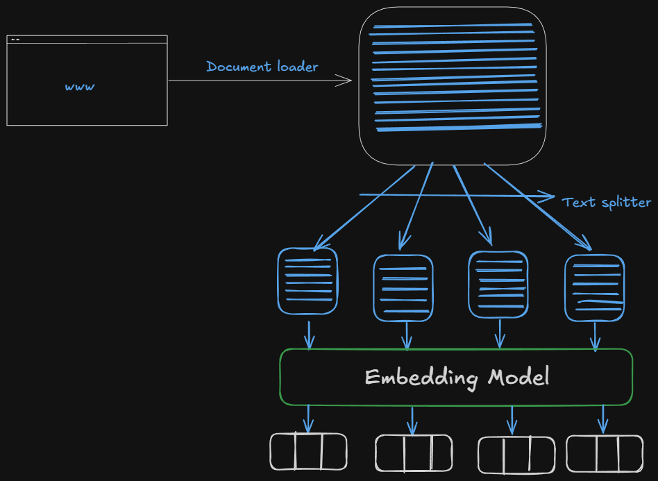
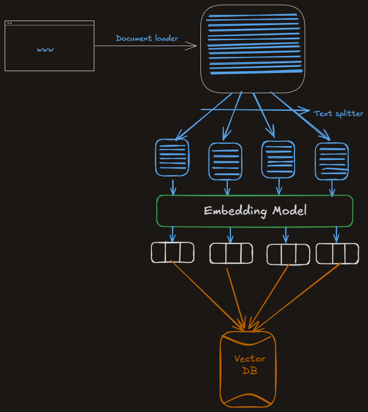
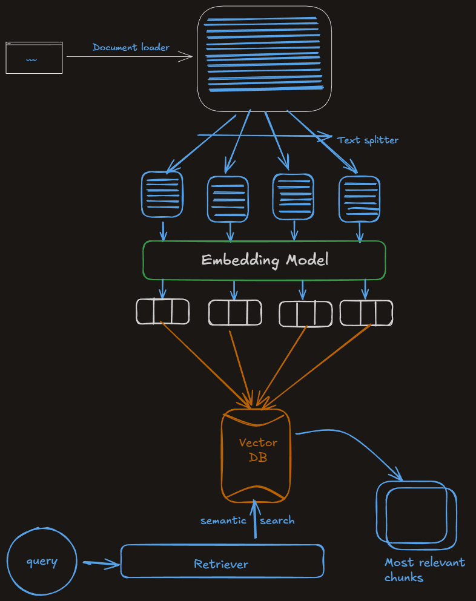
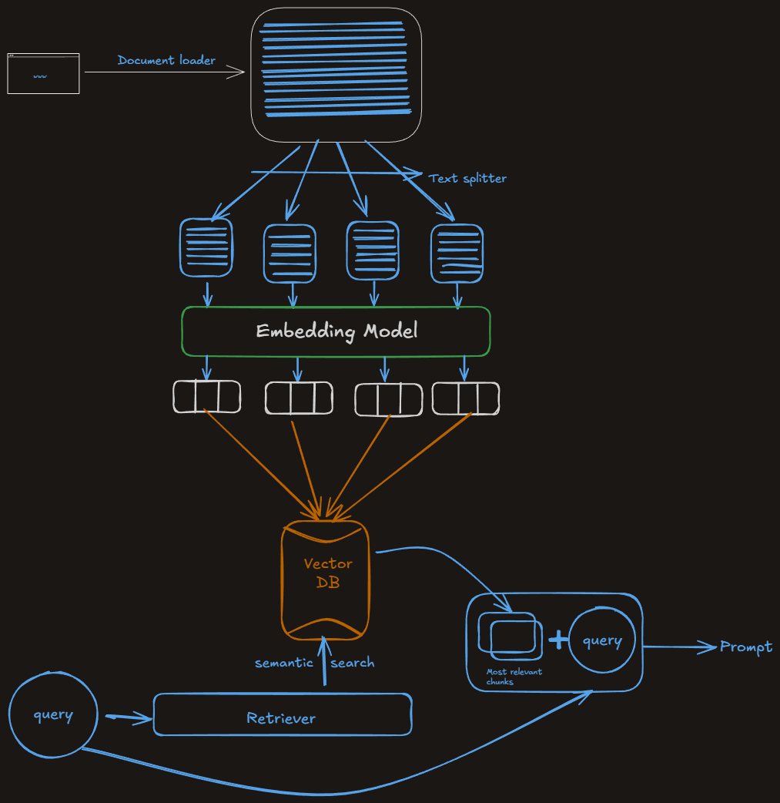
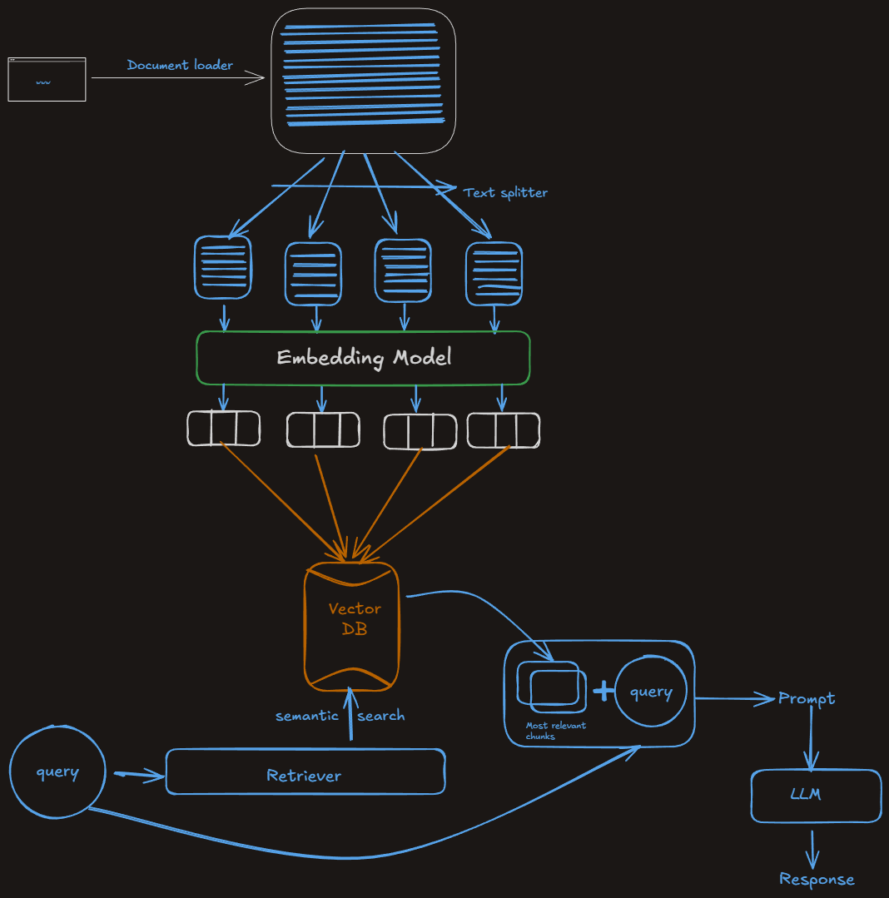

# RAG in Langchain

## Why RAG ?

- As we know LLMs are giant transformer based nuerological archiotecture and LLMs are trained with billions of data.
- So, LLMs have nearly all knowldege about the world and LLMs are stored the data in parameters as numbers. so this knowledge known as parametric knowledge.
- Let we have a LLM which has many data in its parameter, then how can we access the data from it.. ---> Using Prompting.

  

- There are certain situation where the flow does not work, where we can not generate good response from LLM using Prompting.
- Situations Example:-
  1. Where I ask LLM about my private data(from my private website). Any LLM has not trained about our private data, so it can not answer
  2. When we ask about recent or today's news to LLM because LLM has knowledge cutoff(When LLM was trained last). so, LLM can not respond us.
  3. Halucination:- Sometimes LLM can give incorrect response with confidently.
  - **So, what is the correct way to handle LLM. This is known as fine-tuning.**

### Fine tuning :

- We take a pretrained LLM and train it using some outsource data.

  > #### Analogy:- A student got a it job in his college last year. Student is LLM here and the college syallbus is pretraining and when he got a job and got training in company that training is fine-tuning

- Types of fine-tuning.
  - Supervised fine tuning
  - Continued pre training (unsupervised fine tuning)

#### Supervised Fine Tuning :-

- Steps:
  - Step 1:- **Collect Data** - A few hundred-few hundred thousand carefully curated examples
  - Step 2:- **Choose a method** - Full Parameter Fine tuning, LoRA\QLoRA or parameter-efficient adapters.
  - Step 3:- **Train for a few epochs** - You keep the base weights frozen or partially frozen and update only a small subset(LoRA) or all weights(full Fine Tuning).
  - Step 4:- **Evaluate & Safety test** - Measure exact match, factuality, and hallucination rate against held-out data; red-team for safety.

##### **How fine tuning solve our problems situations ?**

- **Private data** : When we train LLM with our private data then model can save it in its parameter and then it can able to answer the questions.
- **Recent Data** : We can fine tune our new data repeatedly to update LLM about our data.
- **Hallucianation** : We can add examples of tricky prompts(where LLM was confused ) to make LLM understand the tricky part, so it can answer about `I don't know`.

  > There are some major problems in fine tuning.

- Problems:-
  - Expensive:- When we fine tune a large model it is very costly.
  - Technical Expertize :- Need AL Engineers and Data scientists.
  - Fine tune need after update any data in our website.

> Now the question is what is the ultimate way to solve our Problems easily. That is Incontext Learning.

### Incontext Learning :-

- InContext Learning is a core capability of LLMs like GPT-3/4, Claude and Llama, where the model learns to solve a task purely by seeing examples in the prompt-without updating its weights.
- Ex:-

  ```
  Below are examples of texts labeled with their sentiment. Use these examples to determine the sentiment of the final text.

  Text - I love this phone. It's so smooth. -> Positive
  Text - The app crashes a lot. -> Negative
  Text - The camera is amazing ! -> Positive


  Text - I hate the battery life -> ?
  ```

- Incontext learning is an emergent property of langchain.
- **Emergent Property** :- It is a behaviour or ability that suddenly appears in a system when it reaches a certain scale or complexity - even though it was not expilicitly programmed or expected from the indivisual components.

## What is RAG :-

- When we imporve incontext learning;
  - Till now we use few shot prompting in incontext learning.
  - Ex:- Let we have a website where there are long videos. for solving doubt we have a chatbot in our website. Suppose the video is for percentage which is a math chapter and the video is 2 hours long and a children has a doubt on a specific question in the video. When he ask to chatbot using a query then we also have to provide the context of the question from video(let 05:00 - 10:12).
  - Here we inject context of question and the query to the LLM(chatbot).The LLM saved it in its parameter. This is known as **`RAG`**
- Definition of RAG :-
  - RAG is a way to make a language model smarter by giving it extra information at the time we ask our question.
    

## How to use RAG ?

- RAG is combine of Informartion retriever and text generation.
- RAG is divided into 4 steps.
  - Indexing :- When we create external knowledge base
  - Retrieval :- We understand query and find chunks which can answer the query in external knowledge base
  - Augmentation :- When we merge user query and retrieve context and make a Prompt.
  - Generation :- When prompt goes to LLM and LLM uses its data to generate response.

### Indexing :-

- Indexing is the process of preparing our knowledge base so that it can be efficiently searched at query time. This steps consists of 4 sub-steps.
  1. Document Ingestion :-
  - We load our source knowledge into memory.
  - Examples:-
    - PDF reports, Word documents
    - Youtube transcripts, blog pages
    - Github repos, internal wikis
    - SQL records, scraped webpages
  - Tools:-
    - Langchain loaders (PyPDFLoader, YoutubeLoader, WebBaseLoader, GitLoader, etc)
      
  2. Text Chunking :-
  - Break large documents into small and semantic meaningful chunks
  - Why chunks ?
    - LLMs have context limits (e.g 4k-32k Tokens)
    - Smaller chunks are more focused - better semantic approch
  - Tools :
    - RecursiveCharachterTextSplitter, MarkdownHeaderTextSplitter, SemanticChunker
      
  3. Embedding Generation :-
  - Convert each chunks into a dense vector that captures its meaning.
  - Why embedding ?
    - Similar ideas and close together in vector space
    - Allows fast, fuzzy semantic search
  - Tools:
    - OpenAIEmbeddings, SentenceTransformerEmbeddings, InstructorEmbedding and etc
      
  4. Storage In Vector Store :-
  - Store the vectors along with the original chunk text + metadata in a vector database.
  - Vector DB options:-
    - Local : FAISS, Chroma
    - Cloud : Pinecone, Weaviate, Milvus, Qdrant
      

### Retrieval :-

- Retrieval is the real time process of finding the most relevant pieces of information from a pre-built index(created during indexing) based on the user's question.
- It is like asking : `From all the knowldege I have,which 3-5 chunks are most helpful to answer this query !`
  

### Augmentation :-

- It refers to the step where the retrieved documents(chunks of relevant context) are combined with the user's query to form a new, enriched prompt for the LLM.
  

### Generation :-

- Generation is the final step where a large language model uses the user's query and the retrieved and augmented context to generate a response.
  
