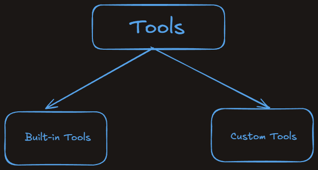
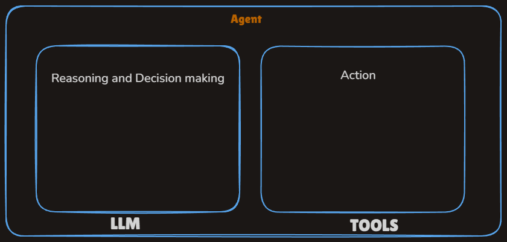
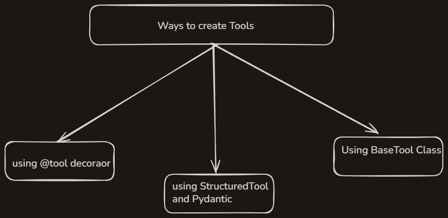

# Tools in Langchain

## What is Tools ?

- A tool is just a python function or API that is wrapped in a way the LLM can understand and call when needed.
- Example:-
  - LLM like GPT are great at :-
    - Reasoning
    - Language generation
  - LLM can not do things like :-
    - Access live data (weather, data)
    - Do reliable math (complex math problems)
    - Call APIs
    - Run code
    - Interact with database

    > LLM can do all these using tools

  - Example:- We can make a function which can get IRCTC website to book tickets.

## Types of Tools:-

- Basically there are two types of tools in langchain.
  

### How tools fits into the Agent Ecosystem

- An AI agent is an LLM powered system that can autonomously think, decide and take actions using external tools or API to achieve a goal.
  
- For building agent both LLM and Tools are very important.

### Built-in tools :-

- Langchain identified some tools are common used like googling
- A built in tool is a tool that langchain already provides for us - it's pre-built, production ready and requires minimal or no setup.
- We don't have to write the function logic by ourself - we just import and use it.
- Popular built in tools
  | **Tools** | **Work** |
  | -------------------- | ------------------------- |
  | DuckDuckGoSearchRun | Web search via DuckDuckGo |
  | WikipediaQueryRun | Wikipedia summary |
  | PythonEPLTool | Run raw Python Code |
  | ShellTool | Run Shell commands |
  | RequestGetTool | Make HTTP GET requests |
  | GmailSendMessageTool | Send emails via gmail |
  | SlackSendMessageTool | Post message to slack |
  | SQLDatabaseQueryTool | Run SQL queries |
  > visit https://colab.research.google.com/drive/1bNBUKQRlIm8OLanAXnfHWm3SBuLCC8Nd#scrollTo=h5D0K7jcLwkx
- There are so many paid and free tools in langchain.

### Custom Tools :-

- When there are no built-in tools for our usecase.
- Example:-
  - We want to call our own APIs.
  - We want to encapsulate buisness logic.
  - We want the LLM to interact with our database, product and app.

### Ways to create custom tools

> visit https://colab.research.google.com/drive/1bNBUKQRlIm8OLanAXnfHWm3SBuLCC8Nd#scrollTo=PZ5XPKhJRp6o

#### Using StructuredTool and Pydantic :-

- A StructuredTool in langchain is a special type of tool where the input to the tool follows a structured schema, typically defined using a Pydantic model.

#### Using BaseTool Class :-

- BaseTool is a abstract base class for all tools in Langchain.
- It defines the core structure and interface that any tool must follow, wheather it's a simple one-liner or a fully customized function.
- All other tool like `@tool`, `StructuredTool` are built on top of BaseTool

## Toolkits:-

- A toolkit is just a collection of related tools that serve a common purpose - packaged together for convenience and reusability.
- In langchain:
  - A toolkit might be: GoogleDriveToolKit
  - And it can contain the following tools
    - `GoogleDriveSearchTool`: Search for a file by name/content
    - `GoogleDriveCreateFileTool`: Upload a file
    - `GoogleDriveReadFileTool`: Read contents of a life

> visit https://colab.research.google.com/drive/1bNBUKQRlIm8OLanAXnfHWm3SBuLCC8Nd#scrollTo=PZ5XPKhJRp6o to get the code

# Tools calling

## How to connect tool with LLM:

- The process in which we connect tools with LLMs is called tool binding.

### Tool Binding :-

- Tool Binding is the step where we register tools with LLMs.

1. The LLM knows what tools are availble.
2. It knows what each tool does (via description)
3. It knows what input format to use (via schema)

### Tool Calling :-

- Tool calling is the process where the LLM decides, during a conversation or task, that it needs to use a specific tool(function) -- and generates a structured output with:
  - the name of the tool
  - the arguments of the tool
- The LLM does not actually run the tool - it just suggests the tool an the input arguments. The actual execution is handled by Langchain or the programmer.
